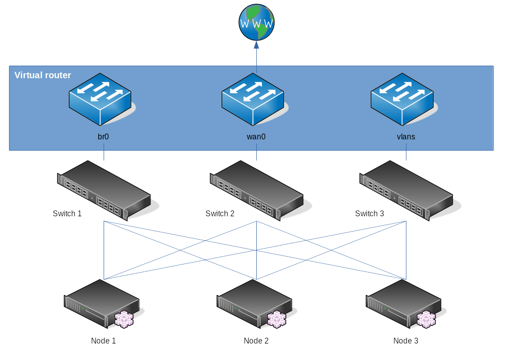

# Personal Cluster

We tried many options such as using Ceph when we designed our clusters and we end up with the following design. 
One key element in our selection was to remain independent of any commercial products. We strongly believe in free software. Another key element was the robustness.

We wanted to have several features available from day one:
- [Hypervisor](https://en.wikipedia.org/wiki/Hypervisor)
- [Software-defined storage](https://fr.wikipedia.org/wiki/Software-defined_storage) & Scale out storage
- Disk Encryption
- [Software-defined networking](https://en.wikipedia.org/wiki/Software-defined_networking)
- [Data deduplication](https://en.wikipedia.org/wiki/Data_deduplication) backup
- Telemetry

resulting in a [hyper converged architecture](https://en.wikipedia.org/wiki/Hyper-converged_infrastructure).

## Hardware requirements

We identified a typical hardware requirements which could be tune on demand.

- 3 regular PC with at least 4 hard drives / SSD and 3 network interfaces
- 3 network switches (L2)
- a connection to internet
- A Rapsberry Pi or a NUC to run a [tang](https://github.com/latchset/tang) server

This procedure can be easily adapted to run a cluster of [Raspberry Pi](https://www.raspberrypi.org/). We managed to run a cluster on 3 Raspberry Pi with limited network capabilities (for instance no routing / no firewall capabilites).

## Components
We selected the following components to fulfill our requirements:

| Component | Feature |
| --- | --- |
| [KVM](https://www.linux-kvm.org/page/Main_Page) / [libvirt](https://libvirt.org/) / [virt-manager](https://virt-manager.org/) | Hypervisor
| [GlusterFS](https://www.gluster.org/) | Software-defined storage & Scale out storage
| [clevis](https://github.com/latchset/clevis) / [luks](https://gitlab.com/cryptsetup/cryptsetup) / [tang](https://github.com/latchset/tang) | Disk Encryption
| [Open vSwitch](https://www.openvswitch.org/) / [OPNsense](https://opnsense.org/) | Software-defined networking
| [BorgBackup](https://www.borgbackup.org/) | Data deduplication backup
| [Prometeus](https://prometheus.io/) | Telemetry

## Network

## VLAN
You can create as many [VLAN](https://en.wikipedia.org/wiki/VLAN) as you want using Open vSwitch and OPNsense. Your L2 switch should support VLAN tagging.

## Storage
The 4 disks of each node will form 4 types of volumes:
- A disk for the Operating System
- A GlusterFS volume to store VM disks (gv0)
- A glusterFS volume to store backup (gv1)
- A disk for barre metal VM disks such as VM running Ceph on Kubernetes (bmv0)

All disk are encrypted except the disk used by the Operating System. 

## Backup
BorgBackup lets you save a lot of space using data deduplication. You could run daily backup and keep a year of history of all VM disks on reasonable disk space.

GlusterFS allows you to snapshot an entire volume which can be helpfull backuping up VMs at once. 

## Install
[Install your first nodes](debian/bookworm/cluster-nodes.md)

